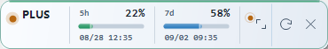
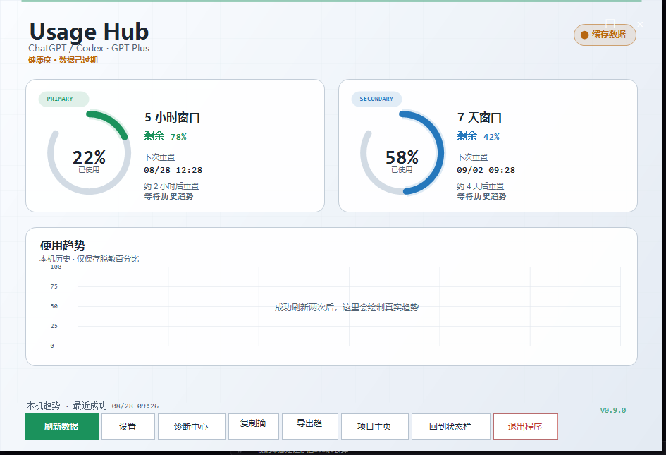

# ChatGPT / Codex Usage Status Bar for Windows

[](https://github.com/chengaliang/chatgpt-codex-usage-statusbar-windows/actions/workflows/build.yml) [](https://github.com/chengaliang/chatgpt-codex-usage-statusbar-windows/stargazers) [](https://github.com/chengaliang/chatgpt-codex-usage-statusbar-windows/issues) [](LICENSE)

## 中文概览

这是一个轻量的 Windows 桌面状态栏，用于查看 **ChatGPT / Codex CLI** 的官方动态额度。它复用本机 Codex CLI 的 ChatGPT OAuth 登录，通过系统网络连接访问 ChatGPT/Codex 后端，显示动态窗口的用量、进度和下一次重置时间；点击空白区域或展开按钮即可进入带环形额度卡、趋势图和操作中心的 Usage Hub 大屏。状态栏和大屏都提供可关闭的平滑过渡、固定位置的状态律动和额度风险色反馈；每次刷新都会先显示“正在刷新”，结束后按实时成功、使用缓存或刷新失败展示短提示，并播放对应颜色的同心脉冲，让数据换新有明确反馈。状态栏支持 35%–100% 不透明度滑块，拖动设置时即时预览，也保留右键快捷档位；“忽略鼠标操作（点击穿透）”展示模式开启后点击会直接交给背后窗口处理。主程序和兼容启动器均带有统一产品图标，重复双击会聚焦已有实例，启动失败会给出明确提示。

项目按官方返回的额度窗口工作，不把功能限定为某一个订阅计划；OAuth 凭据只在内存中使用，不上传、不写日志。默认使用系统代理或直连，需要时再配置本地 HTTP/HTTPS 代理。

如果 OAuth 声明包含套餐类型，状态栏左侧会显示 `PLUS`、`PRO`、`TEAM` 等短标签，Usage Hub 和悬停提示会显示完整套餐名称；无法识别时安全回退为通用的 `GPT`。

## 界面预览

<div align="center">
  
  <br />
  <sub>迷你状态栏：套餐标签、双窗口用量、进度条、重置时间和刷新入口</sub>
  <br /><br />
  
  <br />
  <sub>Usage Hub：完整套餐名称、额度卡、本地趋势和诊断/导出/设置操作</sub>
</div>

首次启动默认开启当前 Windows 用户的开机自启，不需要管理员权限；状态栏右键可关闭或重新开启。右键菜单还提供打开 Usage Hub、立即刷新、刷新周期、主题/透明度、忽略鼠标操作（点击穿透）、诊断中心、复制脱敏诊断信息、导出本地趋势、打开数据目录、分别清除趋势历史或最近成功缓存，以及检查更新，遇到问题可以直接把诊断摘要贴到 Issue。开启展示模式后，可从通知区域托盘菜单取消，不会把状态栏锁死。`Ctrl+Alt+U` 可从任意应用唤起或聚焦 Usage Hub。

> Unofficial Windows desktop status bar for ChatGPT and Codex CLI usage limits. Reads local Codex OAuth credentials in memory, supports optional HTTP/HTTPS proxies, and keeps the mini UI compact at about 370×56 pixels with an on-demand Usage Hub workspace.

## Why This Project

- **Plan-agnostic**: renders any official `rate_limit` windows returned for the signed-in ChatGPT/Codex account; it does not assume Plus-only access.
- **Offline-friendly cache**: keeps the latest successful quota locally and labels stale data clearly when the network or OAuth session is unavailable.
- **Usage Hub workspace**: opens a taskbar-free large view with every returned window, animated gauge cards, reset dates, countdowns and a bounded 7/30/90-day local percentage history.
- **Local insights**: calculates current-cycle consumption rate, trend direction, health label and an explicitly estimated exhaustion time without sending history anywhere.
- **Privacy-first**: reuses the local Codex OAuth session in memory, never asks for API keys, and never uploads or logs credentials.
- **Useful at a glance**: shows 5-hour and 7-day usage, progress bars, local reset date/time, and a compact status indicator without opening a dashboard.
- **Tiny native footprint**: one WinForms executable with a 370×56 overlay and an on-demand Usage Hub workspace, with no runtime installer or background service.
- **Live opacity preview**: tune the overlay from 35% to 100% opacity with a continuous slider; the bar updates while dragging and restores the previous value when settings are cancelled.
- **Network-flexible**: works with Windows system proxy settings or direct connection, with an explicit HTTP/HTTPS proxy option when needed.
- **Easy to verify**: source code, an in-box .NET compiler command, and a Windows Actions build are included in the repository.

## Features

- **Mini overlay**: approximately 370×56 pixels, pinned to the lower-right work area.
- **Official dynamic windows**: displays every official `rate_limit` window, preferring 5-hour and 7-day values in the mini bar when present.
- **Next reset time**: each window shows the local `MM/dd HH:mm`; hover for cache age and safe error details.
- **Plan-aware label**: preserves known Free, Go, Plus, Pro, Team, Business, Enterprise and Edu labels; unknown remote text is sanitized to a generic ChatGPT label.
- **Local OAuth only**: reads `%USERPROFILE%\.codex\auth.json` or `%CODEX_HOME%\auth.json`; never writes credentials back.
- **Optional proxy**: uses the Windows system proxy or a direct connection by default; set `CLASH_MIXED_PROXY` when a local Clash Verge or other HTTP/HTTPS proxy is needed.
- **Safe failure states**: expired OAuth, missing credentials, proxy errors and malformed responses become readable UI states instead of dumping response bodies.
- **Tray-first workflow**: closing the bar hides it to the notification area instead of killing the process; double-click the tray icon to restore it, and use the tray menu to refresh, configure or exit.
- **Configurable and quiet**: choose 1/5/10/15/30/60-minute refresh cycles, 7/30/90-day local history, follow system/light/dark/graphite themes, opaque or three transparency levels, optional click-through display mode, position restore, startup delay, opt-in threshold notifications and smooth visual feedback.
- **Click-through display mode**: make the mini bar a passive always-on display; mouse clicks pass to the window underneath, while the tray menu remains available to turn the mode off.
- **Shortcuts and reminders**: use `Ctrl+Alt+U` to open the Hub, `Ctrl+C` to copy its safe diagnostic summary and `Ctrl+E` to export history; reset and two-hour forecast reminders are opt-in and de-duplicated per quota cycle.
- **Local maintenance**: export only window seconds, percentages and timestamps to a CSV under the app data directory; the context menu can open that directory, and clearing local data removes matching exports too.
- **Motion with purpose**: the mini bar uses a calm, fixed-position status rhythm; Usage Hub animates its entrance, rings, trend points and refresh state without changing the displayed percentage.
- **Refresh feedback**: every refresh announces its start, then shows a short `刷新完成`/`使用缓存`/`刷新失败` status badge and a semantic-color concentric pulse across the mini bar and Usage Hub; no raw response text is exposed.
- **Startup & diagnostics**: first launch enables current-user startup by default; optionally delay the first query or check for updates on startup (prompt only); the diagnostic center shows fixed checks, next actions and a safe copyable report.
- **Diagnostics with context**: the report records local history sample count, forecast availability, hotkey registration conflicts and reminder settings without exposing paths or credentials.
- **Safe updates**: manually checks GitHub Releases, accepts only GitHub HTTPS links, and exposes SHA-256 verification without silently replacing a running binary.
- **No runtime dependency installer**: the checked-in executable can be launched directly, or rebuilt with the .NET Framework compiler already included in Windows.

## Quick Start

### 1. Sign in with Codex CLI

The status bar does not implement a login flow. Sign in once with the official Codex CLI in a terminal:

```powershell
codex login
```

The app expects ChatGPT OAuth mode and an `auth.json` under the Codex home directory.

## Download

For a ready-to-run Windows binary, download [`SubscriptionStatus.exe` from the latest release](https://github.com/chengaliang/chatgpt-codex-usage-statusbar-windows/releases/latest).
Local build output is written to `dist\`; release downloads are kept separate from the source tree.

## Repository Layout

| Path | Purpose |
| --- | --- |
| `src/` | Native WinForms C# source code |
| `scripts/` | Build and optional launch helpers |
| `assets/` | Product icon source asset and deterministic generator |
| `dist/` | Local executable and SHA-256 manifest |
| `SubscriptionStatus.exe` | Small root compatibility shim for older startup entries |
| `docs/` | Chinese quickstart, design notes and preview assets |
| `tests/Smoke/` | Offline reflection and privacy smoke tests |

### 2. Launch the mini bar

Double-click [`start-statusbar.cmd`](start-statusbar.cmd), or run [`scripts/launcher.vbs`](scripts/launcher.vbs). The first launch enables startup for the current Windows user; the app keeps one compact bar above the taskbar and follows the monitor where it starts.
The bar intentionally has no taskbar button or title bar. Its product icon is visible in the notification area; launching it a second time focuses the existing bar instead of opening a duplicate.
Without a custom proxy, the app uses Windows system proxy settings or a direct connection. If your network needs Clash Verge or another local HTTP/HTTPS proxy, set `CLASH_MIXED_PROXY` before launching:

```powershell
$env:CLASH_MIXED_PROXY = "http://127.0.0.1:7890"
Start-Process -FilePath .\dist\SubscriptionStatus.exe -WorkingDirectory (Resolve-Path .\dist)
```

| Action | How |
| --- | --- |
| Move | Drag any empty part of the bar |
| Refresh | Click the circular-arrow icon |
| Hide | Click the `×` icon; the process remains in the notification area |
| Usage Hub | Click the empty bar area, the expand button, or choose **打开 Usage Hub** |
| Global shortcut | Press `Ctrl+Alt+U` to open or focus Usage Hub |
| Export | In Usage Hub press `Ctrl+E`, or choose **导出本地趋势** from the menu |
| Options | Right-click the bar or tray icon for settings and diagnostics |

The default refresh cycle is five minutes. Change it, history retention (7/30/90 days), theme, background transparency, click-through display mode, startup delay, optional startup update prompt, position restore, global shortcut, threshold notifications, reset reminders and forecast reminders from **设置**. Usage Hub keeps only local percentages and reset times for the selected retention period, and its **回到状态栏** action returns to the compact view. To export or inspect those data, use **导出本地趋势** or **打开数据目录**. The menu separates **清除趋势历史与导出** from **清除最近成功缓存**, so you can remove one without touching the other; neither action touches `auth.json`. To exit completely, choose **退出** from the bar or tray menu.

## Build From Source

A Windows machine with .NET Framework 4.5+ can build the WinForms source with the in-box C# compiler. The shared script keeps output and checksums in `dist\`:

```powershell
powershell.exe -NoProfile -ExecutionPolicy Bypass -File .\scripts\build.ps1
```

The repository also includes a GitHub Actions Windows build so source changes are compiled on every push and pull request.

If the icon asset is missing in a local checkout, regenerate it before compiling:

```powershell
powershell.exe -NoProfile -ExecutionPolicy Bypass -File .\scripts\generate-icon.ps1
```

## Updating Safely

Choose **检查更新** from the bar's right-click menu. The app reads the latest public GitHub Release and opens the release page only after you confirm. It never replaces the executable while it is running. If a release asset includes a SHA-256 digest, verify the downloaded `SubscriptionStatus.exe` before launching it; the reusable `UpdateService.VerifySha256` helper is covered by the P1 smoke test.

## Privacy and Security

- **Never upload `auth.json`**. It contains OAuth credentials and is not part of this repository.
- The access token is read into memory only and sent as a Bearer token to the fixed HTTPS ChatGPT/Codex usage endpoint.
- No token, response body, account ID or exception stack is written to a log file or displayed in the bar.
- The tooltip masks the account ID and only shows its last four characters.
- This project does not ask for, store or proxy OpenAI API keys.
- The local cache and selected 7/30/90-day history contain only provider ID, window seconds, percentages and timestamps; they can be removed from the right-click menu.
- Update checks query public GitHub Release metadata only; the app does not auto-download or replace a running executable.
- The usage endpoint is a ChatGPT/Codex backend contract used by compatible clients and may change without notice. This project is not affiliated with OpenAI.

For a friendly end-user walkthrough, read the [中文用户操作手册](docs/USER-GUIDE.zh-CN.md). The [中文快速开始与开发说明](docs/QUICKSTART.zh-CN.md) covers source builds and deeper troubleshooting.

## Troubleshooting

### `OAuth 不可用`

Run `codex login` again and confirm that the CLI is using ChatGPT OAuth mode. Do not paste the contents of `auth.json` into an issue.

### `网络不可用` or `请求超时`

The app uses Windows system proxy settings or a direct connection by default. If your network needs a local proxy, start it and set `CLASH_MIXED_PROXY` to the correct HTTP/HTTPS URL.

### The bar is not visible

Run [`start-statusbar.cmd`](start-statusbar.cmd) again or double-click the product icon in the notification area. If the process is already running, a second launch now restores and focuses the existing bar. The app positions itself inside the current monitor work area and rechecks its position after the first query. Dragging the bar disables automatic repositioning.

### Double-click appears to do nothing or the icon is generic

Keep `dist\SubscriptionStatus.exe` next to its files and start it through [`start-statusbar.cmd`](start-statusbar.cmd). The build embeds the product icon into both EXEs; a missing `dist` folder or an incomplete manual copy can prevent the compatibility shim from reaching the main program. If initialization fails, the program now shows a generic repair message without exposing OAuth or local paths. Rebuild with `scripts\generate-icon.ps1` followed by `scripts\build.ps1` when distributing a source checkout.

### Startup or diagnostics

Right-click the bar to turn current-user startup on or off. **诊断中心** refreshes the official endpoint, shows fixed health checks and next actions, and keeps the report safe to copy. It does not include tokens, account IDs, proxy addresses or full responses.

## 持续维护与反馈

项目目标是长期跟进 ChatGPT/Codex 官方额度接口的变化，定期修复可复现问题，并持续优化兼容性、稳定性和使用体验。欢迎通过 [Issues](https://github.com/chengaliang/chatgpt-codex-usage-statusbar-windows/issues) 提交：

- OAuth、额度窗口、重置时间或网络连接问题
- Windows 版本、显示缩放和窗口布局问题
- 清晰可复现的功能建议和改进想法

提交问题前请先阅读 [`CONTRIBUTING.md`](CONTRIBUTING.md)。反馈中不要粘贴 `auth.json`、OAuth Token、账户 ID、完整响应或个人截图；也可以先在状态栏右键选择“复制诊断信息”，提交已脱敏摘要。每次发布会在 Release 中记录变更。项目对你有帮助时，欢迎点 Star、Watch 或分享给有同样需求的人，这能帮助维护工作持续获得优先级。

## Search Keywords

`chatgpt usage limits` · `chatgpt quota` · `chatgpt plus quota` · `chatgpt pro quota` · `chatgpt team quota` · `codex-cli` · `codex quota` · `subscription status bar` · `windows desktop widget` · `windows startup` · `diagnostics` · `oauth` · `clash-verge` · `usage monitor` · `animated status bar`

If this saves you time, a ⭐ on GitHub helps other users find the project.
